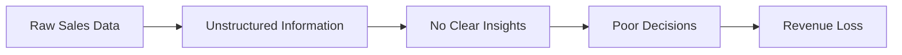

<!-- 🔥 Animated Header Banner -->
<h1 align="center">📊 Sales Analysis & Forecasting</h1>

<p align="center">
  
</p>

<p align="center">
  
  
  
</p>

<p align="center">
  <b>Analyze • Visualize • Predict</b><br>
  <i>Turning raw sales data into powerful business intelligence & future insights</i>
</p>


---

## 🚀 Overview  

The **Sales Analysis & Forecasting** project is a data-driven solution that helps businesses analyze historical sales data and predict future trends.

By leveraging **data analytics, visualization, and machine learning**, this system transforms raw datasets into meaningful insights and accurate forecasts for smarter decision-making.

---


## ⚠️ Business Challenges  




## 💡 Solution  

✔ Exploratory Data Analysis (EDA)  
✔ Pattern & trend detection  
✔ Data visualization dashboards  
✔ ML-based forecasting  
✔ Decision support system  

---


## ✨ Key Features  

- 📊 Advanced Data Analysis  
- 🧹 Data Cleaning & Preprocessing  
- 📈 Trend & Seasonality Detection  
- 📉 Interactive Visualizations  
- 🧠 Machine Learning Forecasting  
- ⚡ Fast & Scalable Processing  

---


## 📸 Screenshots  

### 📊 Sales Dashboard  
<p align="center">
  
</p>

---


### 📈 Trend Analysis  
<p align="center">
  
</p>

---


### 🔮 Forecast Graph  
<p align="center">
  
</p>

---


### 📉 Category Insights  
<p align="center">
  
</p>

---


### 📊 Performance Metrics  
<p align="center">
  
</p>

---


## 🧰 Tech Stack  

<p align="center">
  
</p>

---


## ⚙️ Installation  

```bash
git clone https://github.com/Abhijeet241/Sales-Analysis-Forcasting-.git
cd Sales-Analysis-Forcasting-

pip install -r requirements.txt
jupyter notebook Sales-Analysis-Forcasting-/
```


## 📂 Project Structure
```
Sales-Analysis-Forcasting-/
│
├── data/                
├── notebooks/           
├── visuals/             
├── models/              
├── requirements.txt     
└── README.md                      
```


## 📊 Performance  

- 🎯 Accurate forecasting  
- ⚡ Fast processing  
- 📊 Clear insights  
- 🔐 Scalable system  

---


## 🚀 Future Enhancements  

- 🔹 Streamlit / Flask dashboard  
- 🔹 ARIMA / LSTM models  
- 🔹 Real-time pipeline  
- 🔹 Interactive BI dashboards  

---


## 👨‍💻 Author  

**Abhijeet Singh**  

- 🌐 GitHub: https://github.com/Abhijeet241  
- 💼 LinkedIn: https://www.linkedin.com/in/abhijeet-singh-99a855251/  

---


## ⭐ Support  

- ⭐ Star this repo  
- 📢 Share it  
- 🤝 Contribute  

---

<p align="center">
  📊 Transforming Data into Decisions, One Insight at a Time 🚀
</p>
